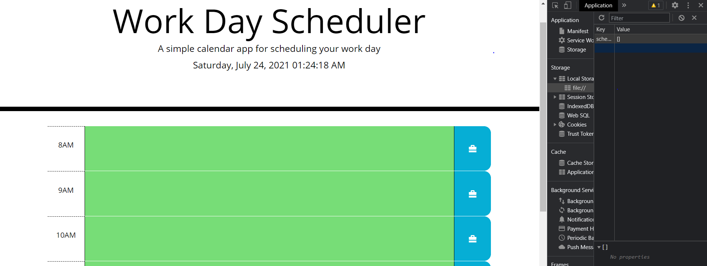
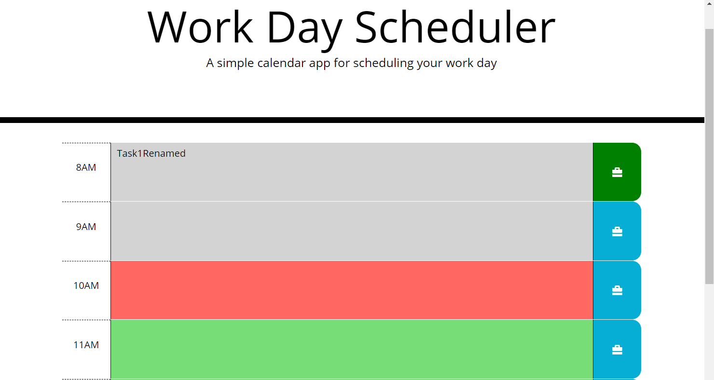
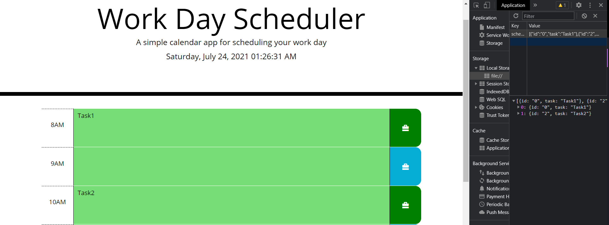
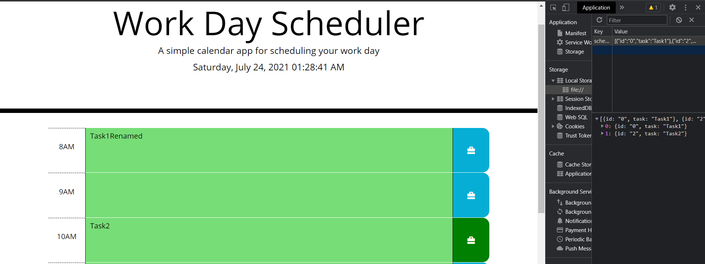
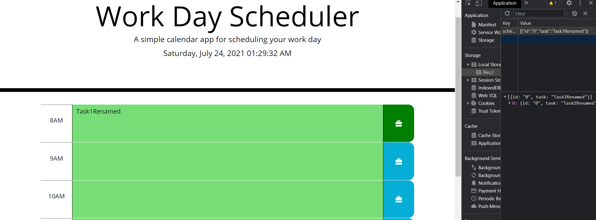
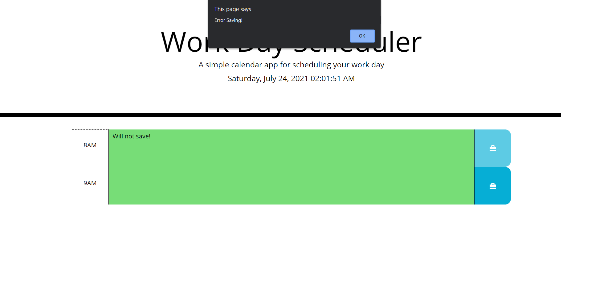
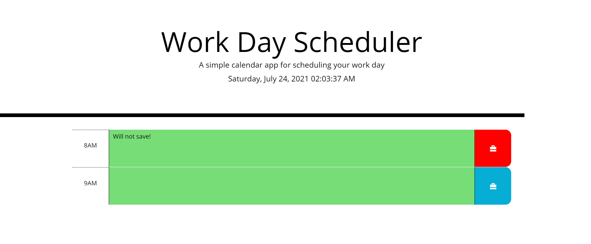

# Work Day Scheduler Code
## Work Day Scheduler Requirements
 Code a simple planner using jquery for DOM element manipulation, moment.js for time format manipulation and bootstrap for grid layout.

 ### Work Day Scheduler Grading Criteria:
        - [✔️] Current Day is display at top of calendar.
        - [✔️] Scrolling down shows different timeblocks for std business hours.
        - [✔️] Time blocks are color coded depending on whether it is in past/present future.
        - [✔️] Clicking on the blocks allows to add task/event.
        - [✔️] Clicking the save button on the block saves the event/task of only that block.
        - [✔️] Tasks/events are saved in local storage.
        - [✔️] Tasks/events persists when reloading page.

 ### Work Day Scheduler Grading Enhancements:
        - [✔️] When task/event is saved button turns green to let user known data was saved.
        - [✔️] Text changes in textarea will revert button to blue to let user know that new text is not saved and data in storage will modified.
        - [✔️] Error on saving will cause the button to turn red.
        - [✔️] Saving empty events/tasks will cause the event/task to be removed. 
        - [✔️] Past tasks/events are not editable. 

Please see link below for Coding Quiz accessible URL: 
        https://darkjuanjo.github.io/schedule-organizer/
        
**Below is the source code for the Work Day Scheduler Grading in GitHub. Please note that code is in assets/js. **
        https://github.com/darkjuanjo/schedule-organizer

## See below for some screenshots

### Home Page

### Past-Present-Future Events

### Saved

### Text Change no Save
Notice how the 8AM button was changed to blue after the text was changed.

### Text Change Save
Notice how the 8AM button was changed to green after the text was changed and saved and how the 10AM task was removed from localstorage  and button turned to blue since the event was deleted and saved.

### Error Saving
If there is an issue saving an alert will pop up and the button of the block will turn red.

